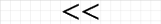

<h1>Перебор</h1>
<ul>
    <li><a href="#loop">Перебор циклами</a></li>
    <li><a href="#mask">Перебор по маске</a></li>
    <li><a href="#rec">Рекурсивный перебор</a></li>
</ul>
<p>Допустим у вас есть некоторый набор объектов и вам нужно найти такую комбинацию этих объектов,
которая удовлетворяла бы некоторой характеристике (критерию отбора).</p>
<p>Как найти такую комбинацию?</p>
<h3>Пример:</h3>
<p>Вы купили новый чемодан с кодовым замком. Играясь с новым чемоданом вы установили код, а затем успешно забыли его.
Как быть в этом случае? Кодовый замок состоит из трех цифр.
Самый долгий, но верный вариант в этом случае действовать таким образом:</p>
<h2 id="loop">Перебор вложенными циклами</h2>
<p>Мы знаем, что код устанавливается при помощи трех рулеток с цифрами от 0 до 9.
Давайте переберем всевозможные комбинации таких кодов. Возникает вопрос, <b>а как их всех перебрать?</b></p>
<p>Для понимания этого давайте сначала упростим задачу и предположим, что наш кодовый замок состоит
из одной рулетки с цифрами от 0 до 9. Ну тогда вам не составит особого труда перебрать такой код, верно?</p>
<p align="center"></p>
<p>Теперь немного усложним задачу. Пусть наш код состоит из двух цифр.</p>
<p>Как перебирать тогда?</p>
<p>Давайте покрутим первую рулетку и поставим 0, затем перейдем ко второй рулетке и... а, что тут ставить-то?</p>
<p>Тут придется ставить все!</p>
<p>Это как? - спросите вы.</p>
<p>А вот так:</p>
<p align="center"></p>
<p>Как видно из примера каждая цифра одной рулетки <b>сопоставляется с каждой</b> цифрой другой рулетки. Таким образом
    мы переберем все варианты кодов <b>ничего при этом не пропустив</b>. <b>Что очень важно</b>. Если бы вы просто гадали, пытаясь
вспомнить свой код и набирая его на замке, то уже через 6-8 попыток просто повторяли бы уже проверенные
комбинации цифр. Человеческая память очень ограничена, увы.</p>

<p>Итак мы подошли к нашей первоначальной задаче. У нас есть код состоящий из 3-х цифр, который мы успешно забыли.</p>
<p>Как его найти?</p>
<p>Мы уже умеем находить код состоящий из двух цифр. Теперь у нас добавилась еще одна рулетка, а это значит, что каждую
    найденную комбинацию для двух цифр мы должны еще раз <b>сопоставить с каждой цифрой</b> из третьей рулетки.</p>
<p align="center"></p>

<p>Как видно из примера, двухциферные коды еще можно выписать на бумажке, хотя и это достаточно утомительное дело.
Совсем не хочется делать это для трехциферного кода.</p>
<p>Давайте лучше запрограммируем наш перебор.</p>

<p>Так выглядит перебор кода состоящего из одной цифры</p>


```csharp
for (int i = 0; i <= 9; i++)
{
    Console.WriteLine("{0}", i);
}
```

<p>Все просто. Один цикл от 0 до 9 включительно.</p>
<p>Для двухциферного кода мы просто добавляем вложенный цикл.</p>

```csharp
for (int i = 0; i <= 9; i++)
{
    for (int j = 0; j <= 9; j++)
    {
        Console.WriteLine("{0} {1}", i, j);
    }
}
```

<p>Ну и для нашей задачи нам нужно три вложенных цикла:</p>

```csharp
for (int i = 0; i <= 9; i++)
{
    for (int j = 0; j <= 9; j++)
    {
        for (int k = 0; k <= 9; k++)
        {
            Console.WriteLine("{0} {1} {2}", i, j, k);
        }
    }
}
```

<p>Таким образом, добавляя вложенные циклы мы можем написать практически любой перебор. Скажем, если бы код состоял из 6 цифр, то нам бы
    пришлось написать код из шести (!) вложенных циклов. Все это не только выглядит <b>громоздко</b> и <b>неповоротливо</b>, но и на практике зачастую
    бывает очень <b>медленно</b> и <b>неудобно</b> при работе.</p>
<p>Хотелось бы как-то попроще.</p>
<p>Перед тем как показать более простой в составлении, но более сложный в понимании алгоритм перебора, давайте
еще более усугубим нашу задачу и поймем почему перебор со вложенными циклами очень неудобный.</p>
<p>Выше мы рассматривали три примера с перебором одно- двух- и трехциферного кода. Что если мы не знаем точно, какой длины должен быть код?
Представьте, что у нас есть такой замок, что в нем можно установить код состоящий минимум из одной цифры или максимум из трех цифр.</p>
<p>Как перебирать в этом случае?</p>
<p>Тогда придется написать что-то вроде этого:</p>


```csharp
int firstDigitCode = 3;
int secondDigitCode = 4;
int thirdDigitCode = 5;

bool found = false;

for (int i = 0; i <= 9; i++)
{
    // One digit code
    if (i == firstDigitCode)
    {
        found = true;
        break;
    }
    for (int j = 0; j <= 9; j++)
    {
        // Two digit code
        if (i == firstDigitCode && j == secondDigitCode)
        {
            found = true;
            break;
        }
        for (int k = 0; k <= 9; k++)
        {
            // Three digit code
            if (i == firstDigitCode && j == secondDigitCode && k == thirdDigitCode)
            {
                found = true;
                break;
            }
            Console.WriteLine("{0} {1} {2}", i, j, k);
        }
    }
    if (found)
    {
        break;
    }
}
```

<p>В каждом цикле мы должны проверять, а не нашли ли мы уже код. Если нашли, то останавливаемся. Сразу чувствуется "<b>хрупкость</b>" такого кода.
Проблема в том, что у нас еще не самая сложная задача. Представьте, что вам нужны еще более <b>изощренные</b> проверки.</p>
<h2 id="mask">Перебор по маске</h2>
<p>Этот способ потребует некоторого понимания работы с битами, но как только вы уловите суть, алгоритм станет очень простым для понимания.</p>
<p>Итак, мы знаем, что бит может принимать два значения. 1 или 0.
<blockquote>Давайте будем считать, что если значение бита равно <b>1</b>, то объект <b>учитывается</b> при переборе,
если же значение бита равно <b>0</b>, то объект <b>не учитывается</b> при переборе.</blockquote> Пока это сложно осознать целиком, но далее вы все поймете.</p>
<p>А если у нас два бита? Это значит у нас два объекта для перебора.</p>
<p align="center"></p>
<p>Всего получилось 4 комбинации. Кстати, а этот пример вам ничего не напоминает?
Да, это тот же перебор, как и в примере с цифровым кодом. Если там мы перебирали цифры от 0 до 9 и <b>сопоставляли каждую цифру</b> с каждой другой,
то здесь мы перебираем все состояния каждого бита и <b>сопоставляем</b> со всеми состояниями каждого другого бита.<p>
<p>Еще один важный момент. Допустим у нас есть два объекта (как выше на рисунке) и мы хотим их перебрать. Как нам написать перебор циклами?
Как-то непонятно, да? Ведь выше на примерах были цифры, и мы могли запустить цикл от [0 до 9] и в теле циклов делать все что хотим с этими цифрами, а тут объекты...
<blockquote>Так вот на самом деле, вы чаще столкнетесь с объектами (те же числа или символы или строки и т.д.), а не с числами. Числа -- это просто частный случай.</blockquote>
<p>Давайте представим наши объекты как некий набор. Используем <strong>массив</strong> как самую простую структуру в качестве набора наших объектов.
Тогда количество вложенных циклов будет отражать количество объектов. В данном конкретном случае у нас будет два цикла. Хорошо. Тогда возникает вопрос: А сами циклы какие значения пробегают? В нашем случае эти значения соответствуют всем состояниям бита. Так как у бита всего два стостояния 1 или 0, то в цикле будет всего 2 итерации.</p>
<p>Еще раз для закрепления. Если один объект, то 1 цикл, если два объекта, то 2 цикла, если <strong>N</strong> объектов, то <strong>N</strong> циклов. Теперь зададимся вопросом, а сколько всего итераций делает наш код? Зачем нам это нужно знать? Ну во-первых, это нужно для понимания работы следующего алгоритма.
<blockquote>Во-вторых, есть такая штука как временная сложность работы алгоритмов. Это теоретическая часть очень важна, так как помогает оценить в худшем/среднем/лучшем случае как
долго будет работать наш алгоритм.</blockquote>
Взглянем на картинку ниже:</p>
<p align="center"></p>
<p>Возвращаемся к нашим битам и посмотрим пример для трех бит (трех объектов перебора):</p>
<p align="center"></p>
<p>Всего получилось 8 комбинаций. И больше сделать невозможно. А есть ли возможность сразу узнать сколько комбинаций получится для <strong>n-ного</strong> количества объектов?
По формуле приведенной выше, как раз можно узнать сколько всего комбинаций получится для любого количества объектов.</p>
<blockquote>Расшифруем формулу еще более детально. <strong>a</strong> -- это количество состояний, которое может принимать объект. Степень <strong>n</strong> -- это количество объектов. Бит принимает 2 состояния (0 или 1), а всего битов у нас 3. Получается 2 в степени 3 или 2 * 2 * 2 = 8 комбинаций.</blockquote>
<h4>Теперь немного битовых операций</h4>
<p>Для нашего перебора нам понадобится знание двух битовых операций.</p>
<ul>
<li><span>Битовый сдвиг влево</span>
 <br>
 
 </li>
<li><span>Битовое И</span>
<br>

</li>
</ul>
<h4>Битовый сдвиг влево обозначается так <strong><<</strong></h4>
<s>Есть еще битовый сдвиг вправо <strong>>></strong>. Который обозначает деление на 2. Но тут мы его не будем разбирать.</s>
<p>Взглянем на картинку. На ней мы видим, что число 1 изменяется с применением побитового сдвига влево. В данном случаем мы двигаем только единицу.
После каждого сдвига у нас получается число, которое всегда соответствует <strong>степеням двойки</strong>. Да, теперь вы знаете как получать степени двойки при помощи,
битовых операций.</p>
<p align="center"></p>
<blockquote>Для того, чтобы было проще запомнить, что делает операция и не путать ее с операцией <strong>>></strong> просто посмотрите в какую сторону смотрит стрелка?
Если влево, то значит единица сдвигается к левому краю, а чем левее единицы тем выше разряд и больше число.
То есть число только увеличивается.</blockquote>
<p>На самом деле двигать можно не только единицу, а вообще <strong>любое число</strong>.</p>
<p>На этой картинке мы видим, что изначально у нас было число 5, а затем мы к нему применяем битовый сдвиг влево.</p>
<p align="center"></p>
<h4>Битовая операция И обозначается так <strong>&</strong></h4>
<p>Давайте просто взглянем на картинку. На тех позициях, где биты чисел равны единицам, в результате операции будет единица.
Все! Нам важно только это.</p>
<p align="center"></p>
<h4>Алгоритм перебора по маске <s>наконец</s>.</h4>

```csharp
for (int i = 1; i <= (1 << 3); i++)
{
    for (int j = 0; j <= 2; j++)
    {
        if (Convert.ToBoolean(i & (1 << j)))
        {
            Console.Write(j + 1);
        }
    }
    Console.WriteLine();
}
```

<p>Давайте разберемся, что тут за магия, держа в уме всю ту теорию, которую мы прошли выше.</p>

<p>Непонятны пару вещей:</p>
<ul>
<li><strong>(1 << 3)</strong>
</li>
<li><strong>i & (1 << j))</strong>
</li>
</ul>
<p><strong>(1 << 3)</strong> -- побитовый сдвиг влево. В данном случае 1 сдвигается влево на 3 позиции. Мы знаем, что если сдвигать единичку влево, то получившееся число всегда будет
соответствовать степени двойки. В данном случае у нас получится 2 в степени 3, а это 8. Значит первый цикл бежит от [1 до 8]. Почему от 1 и до 8? Ну тут в качестве
примера, мы взяли 3 бита. По вышеприведенной формуле мы знаем конечное число комбинаций из трех бит. Оно равно 8.
<p><strong>i & (1 << j)</strong> -- тут придется попотеть. Разберем сначала еще один побитовый сдвиг влево. <strong>j</strong> - у нас стоит во внутреннем цикле и пробегает значения от [0 до 2].
Тогда при сдвигании у нас будет следующее:
<br>
1 << 0 = 1
<br>
1 << 1 = 2
<br>
1 << 2 = 4
<br>
Теперь рассмотрим побитовое И. <strong>i</strong> - это у нас комбинация. Не забываем. То есть это все такие комбинации из трех бит, которые мы разбирали выше. Вот <strong>каждую</strong> из этих комбинаций мы будем использовать во внутреннем цикле, где будем применять побитовую операцию И (&) с каждым сгенерированным числом 1, 2, 4.</p>
<blockquote>Могут остаться вопросы, а зачем нам все эти комбинации и вообще где тут маски, а также зачем нам генерировать числа 1, 2, 4? Комбинации нужны, чтобы сгенерировать всевозможные варианты включения и исключения объектов в переборе. Нам очень важно ничего не пропустить. И наши комбинации это гарантируют. Далее, если у вас есть всевозможные комбинации, то как теперь по ним "реально" перебирать объекты? Для этого нам понадобится трюк со степенями двойки и побитовым И (&). Посмотрите на рисунок, где сдвигается только единица. При каждом сдвиге, есть всегда только один бит равный единице. То есть учитывается только один объект. Но так как внутренний цикл пробегает по всем объектам, то мы ничего не упускаем и сравниваем каждый бит каждой комбинации с каждой <strong>маской</strong>. Да. внутренний цикл -- это и есть набор наших масок для каждого объекта. Наконец, операция И (&) во внутреннем цикле выберет только те объекты, которые имеют единичку в том же разряде что и конкретная комбинация.</blockquote>
<p>Для наглядности рассмотрим картинку, где разобраны две итерации алгоритма, но с четырьмя битами:</p>
<p align="center"></p>

<blockquote>В заключение по этой теме, отметим, что алгоритм перебирает 3 объекта только в качестве примера. Вот тут <strong>Console.Write(j + 1); </strong> мы поставили j + 1 только для демонстрации того, что генерируются числа 1, 2 и 3. Если поставить просто j, тогда будут сгенерированы числа 0, 1 и 2. Что соответствует индексам массива в нулевой индексации.</blockquote>
<h2 id="rec">Рекурсивный перебор</h2>
<p>Этот алгоритм не перебирает какие-то конкретные объекты, а для наглядности просто выводит все комбинации из трех бит. Ровно то же самое, что мы делали для перебора при помощи битовых масок.</p>
<p>Для начала взглянем сразу на алгоритм, чтобы <s>встретить врага в лицо</s> отталкиваться от него.</p>

```csharp
public static void recursiveBruteforce(int idx, int[] a, bool[] used)
{
    if (idx == a.Length)
    {
        for (int i = 0; i < a.Length; i++)
        {
            if (used[i])
            {
                Console.Write("{0} ", a[i]);
            }
            else
            {
                Console.Write("0 ");
            }
        }
        Console.WriteLine();
    }
    else
    {
        used[idx] = false;
        recursiveBruteforce(idx + 1, a, used);
        used[idx] = true;
        recursiveBruteforce(idx + 1, a, used);
    }
}
static void Main(string[] args)
{
    int[] a = new int[]{1, 1, 1};
    bool[] used = new bool[3];

    recursiveBruteforce(0, a, used);
}
```
<p>В коде видно, что тут у нас аж два вызова рекурсии. С одним-то проблемы, а тут целых два!</p>
<p>Рекурсия всегда вызывает сложность потому что довольно трудно уследить за ходом рекурсивных вызовов когда они сильно <strong>ветвятся</strong> и уходят довольно <strong>глубоко</strong>. 
Поэтому давайте представим работу нашего алгоритма в виде дерева рекурсивных вызовов.</p> 
<p>Перед этим еще раз напомним как формируются <strong>всевозможные</strong> комбинации из трех бит (трех объектов).</p>
<p align="center"></p>
<p>Как показано на картинке, удобнее смотреть на формирование комбинаций слева направо. Как только добавился новый объект слева, то все его значения (а у нас их два, потому что у нас бит) надо сопоставить со всеми значениями первого объекта.
При этом каждый раз когда мы добавляем новый объект для перебора, количество комбинаций удваивается. Почему это так было, отмечено выше.
<blockquote>Это в некотором смысле похоже на таблицу умножения. Вот у вас 3 яблока и 4 груши. Сколькими способами можно выбрать одно яблоко и одну грушу? Надо просто перемножить 3 яблока на 4 груши. Берем яблоко 1 и грушу 1 -- один способ. Берем яблоко 1 и грушу 2 -- это второй способ и т.д. Всего 12 способов. </blockquote>
</p>
<p>Вспомнив как формируются комбинации, взглянем на дерево рекурсивных вызовов.</p>
<p align="center"></p>
<p>Как вы можете заметить, сразу после вызова рекурсивной функции у нас начинается ветвление. И каждая ветка у нас сама делится <strong>всегда</strong> на два новых ветвления. Так вот два вызова рекурсии в нашем коде -- это и есть ветвление всегда на 2. Скажем, если бы нам надо было ветвить всегда на 3, то мы бы сделали 3 вызова рекурсии. Ну или если нам нужно <strong>k</strong>-ветвлений, мы бы запустили цикл и в нем рекурсивно k-раз вызывали бы сами себя.</p>
<p>Ко всем своим неудобствам перечисленным выше, рекурсия опасна еще и тем, что зачастую приводит к зависанию программы или к переполнению стека рекурсивных вызовов. Поэтому очень важно всегда предусматривать выход из рекурсии.</p>
<p>Обычно это первое над чем стоит подумать при составлении рекурсивной функции. Грубо говоря, нужно придумать такое условие, после которого рекурсия всегда завершится. В нашем случае такое условие достигается тогда, когда количество рекурсивных вызовов становится больше количества бит.</p>
<p>Вас может немного сбить с толку то, что если под дебаггером взглянуть на вызовы функции, то она завершается, когда idx становится равным длине массива a. То есть 3. Хотя выше было сказано, что рекурсия должна завершиться, когда вызовов стало больше. Однако, если вы взгляните на самый первый вызов нашей рекурсивной функции, то она запускается с параметром 0. Поэтому когда idx станет равным 3, на самом деле рекурсивных вызовов будет уже 4.</p>
<p>Нужно отметить, что говоря о завершении рекурсии здесь имеется в виду вывод сформированной комбинации. То есть сама функция не завершится мгновенно. Так как стэк рекурсивных вызовов достиг указанного уровня и ему надо “вернуться назад”, при этом дополнив остальные создаваемые комбинации бит. Вот каждая такая ветка должна завершиться выводом комбинации, пока больше не останется никаких ветвлений и стэк вызовов не станет пуст.</p>

<blockquote>Тут могут остаться вопросы по способу реализации рекурсивного перебора. Зачем там целочсиленный массив из трех элементов? Да еще и проинициализированный всеми единицами?
Зачем нам булевый массив из трех элементов? На это нужно смотреть так: Массив из трех единичек -- это наш массив объектов. То есть каждый элемент этого массива -- это объект. Теперь нам нужно как-то различать, а какие элементы массива сейчас учитываются при переборе (при составлении комбинации), вот для этого нам нужен булевый массив. Он также состоит из трех элементов и они соответствуют нашим объектам (индекс и там и там -- это и есть индекс нашего объекта). Истина означает, что объект учитывается при переборе, Ложь -- не учитывается. Последнее что нам осталось это разобрать сами рекурсивные вызовы. Первый из них запускается, когда определенный элемент булевого массива, устанавливается в ложь. Второй вызов запускается, когда элемент булевого массива устанавливается в истину. Возвращаясь к картинке, эти вызовы соответствуют двойному ветвлению на 0 и на 1.</blockquote>
